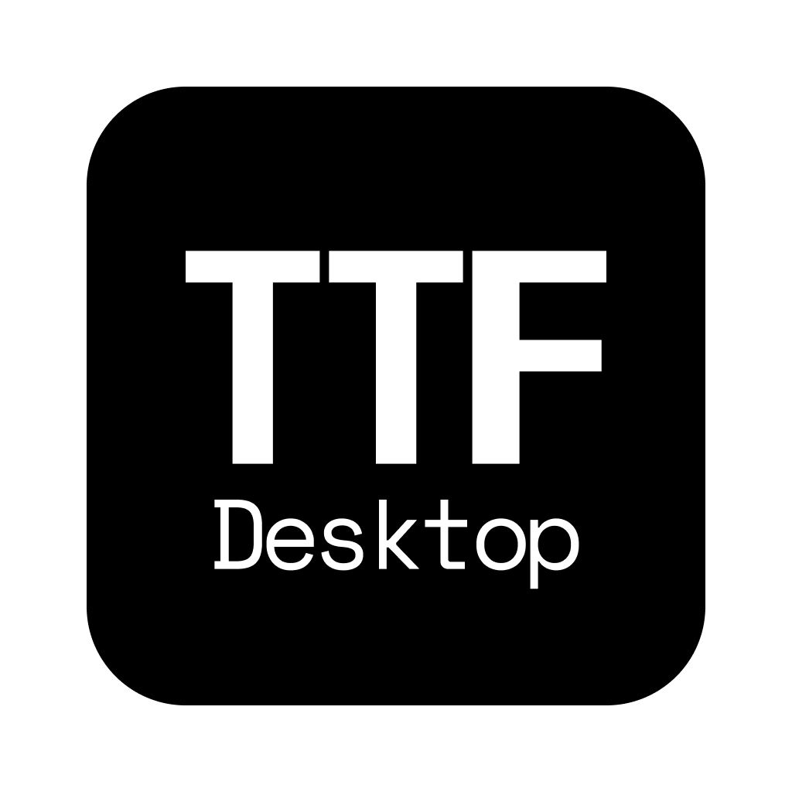

<p align="center">
  
</p>

<h1 align="center">Cursor Talk to Figma desktop</h1>

<p align="center">
  <b>A Kotlin-based desktop companion for seamless Figma-to-MCP integration</b>
  <br>
  <i>Ported from the original TypeScript project with enhanced desktop capabilities</i>
</p>

<p align="center">
  <a href="https://github.com/FigmaAI/TalkToFigmaDesktop/releases">
    
  </a>
  <a href="https://github.com/FigmaAI/TalkToFigmaDesktop/blob/main/LICENSE">
    
  </a>
  <a href="https://kotlinlang.org/">
    
  </a>

</p>

<p align="center">
  <a href="#installation">Installation</a> •
  <a href="#getting-started">Getting Started</a> •
  <a href="#features">Features</a> •
  <a href="#original-project">Original Project</a> •
  <a href="#troubleshooting">Troubleshooting</a>
</p>

---

## 🙏 Acknowledgments to Original Project

> [!TIP]
> This project is a Kotlin Compose Desktop application ported from [@sonnylazuardi](https://github.com/sonnylazuardi)'s [**cursor-talk-to-figma-mcp**](https://github.com/sonnylazuardi/cursor-talk-to-figma-mcp) project, enabling direct WebSocket and MCP server capabilities. We deeply appreciate the innovative ideas and implementation of the original project.

## ⚠️ Disclaimer

> [!IMPORTANT]
> **This project is not affiliated with, sponsored by, or endorsed by Figma, Inc.** This is an independent, community-developed open source project that provides interoperability with Figma's platform. "Figma" is a trademark of Figma, Inc. The use of the Figma name in this project is purely descriptive, indicating the software's functionality to interact with Figma files and the Figma API.

## Features

- 🚀 **Start/Stop Servers**: Control WebSocket and MCP servers from tray menu
- 📊 **View Logs**: Built-in log viewer with clear and copy functions
- ⚙️ **MCP Configuration**: Easy copy-paste configuration for Cursor or whatever
- 🔄 **Auto Port Management**: Automatic port conflict resolution
- 🖥️ **System Tray**: Clean interface with status indicators
- 📈 **Analytics & Crash Reporting**: Google Analytics integration for monitoring app usage and crashes

## Installation

### Download Pre-built Releases

1. Go to [Releases](https://github.com/FigmaAI/TalkToFigmaDesktop/releases)
2. Download the appropriate version for your platform:
   - **macOS Apple Silicon**: `TalkToFigma-v*.*.* -arm64.dmg`
   - **macOS Intel**: `TalkToFigma-v*.*.* -intel.dmg`
   - **Windows**: `TalkToFigma-v*.*.*.msi` or `.exe`

### ⚠️ Security Warning (First Run)

Since this is an open source community build (unsigned), your system will show security warnings:

**macOS:**
1. **"Cannot be opened"** dialog will appear
2. Go to **System Preferences** → **Security & Privacy** → **General**
3. Click **"Open Anyway"** next to the blocked app message
4. Or right-click the app → **"Open"** → **"Open"** in the confirmation dialog

**Windows:**
1. **SmartScreen** warning: *"Windows protected your PC"*
2. Click **"More info"** → **"Run anyway"**
3. This is normal for applications not yet recognized by Microsoft's reputation system


## Getting Started

### 1. Launch Cursor Talk to Figma desktop

- **macOS**: Find in Applications folder or Launchpad
- **Windows**: Start menu → Cursor Talk to Figma desktop

The application will appear in your system tray with a server icon.

### 2. Start the Servers

Right-click the system tray icon and select:
- **"Start All Services"** - Starts both WebSocket (port 3055) and MCP (port 3056) servers
- Or start them individually if needed

> [!WARNING]
> **Port Requirements**: Cursor Talk to Figma desktop requires ports **3055** (WebSocket) and **3056** (MCP) to be available. If you have other applications using these ports, you may need to stop them first or use "Kill All Servers" from the tray menu.

You'll see status indicators:
- : Servers running
- : Servers stopped

### 3. Configure MCP in Cursor

1. Click the tray icon → **"MCP Configuration"**
2. Copy the displayed configuration
3. Paste into your Cursor settings under MCP servers:

> [!NOTE]
> The config contains both Cursor Talk to Figma desktop and the official Figma DevMode MCP server URL.

```json
{
  "mcpServers": {
    "Figma": {
      "url": "http://127.0.0.1:3845/mcp"
    },
    "TalkToFigmaDesktop": {
      "url": "http://127.0.0.1:3056/sse"
    }
  }
}
```

### 4. Install Figma Plugin

Install the official plugin: [**Cursor Talk to Figma MCP Plugin**](https://www.figma.com/community/plugin/1485687494525374295/cursor-talk-to-figma-mcp-plugin)

> [!IMPORTANT]
> **Important Note About Prerequisites**: The plugin page may mention installing bun.sh and other prerequisites. **These are NOT required when using Cursor Talk to Figma desktop**, as this application already includes all necessary server components. You can safely ignore those instructions and simply install the plugin directly.

> [!TIP]
> **Plugin Connection**: The Figma plugin will automatically attempt to connect to your desktop app on port 3055. Make sure Cursor Talk to Figma desktop is running with servers started before launching the plugin.

### 5. Connect and Use

1. **In Figma**: Run the plugin and ensure it connects to the desktop app
2. **In Cursor**: The MCP server will now be available for AI interactions
3. **Start Creating**: Use Cursor AI with seamless Figma integration!


## Troubleshooting

> [!NOTE]
> **Quick Diagnosis**: Most issues can be resolved by checking the application logs. Right-click the tray icon → "View Logs" to see detailed error information.


**🔌 Connection Problems**
1. Right-click the tray icon → **"Kill All Servers"**
2. Wait a few seconds, then → **"Start All Services"**
3. If still not working → **"View Logs"** to see what's happening

**🛡️ Installation & Security Issues** 
- **macOS**: If "Cannot be opened" appears → System Preferences → Security & Privacy → "Open Anyway"
- **Windows**: If SmartScreen warning appears → "More info" → "Run anyway"
- **Why warnings occur**: Community builds are unsigned (no code signing certificate) but are safe to use

**🔧 Server Won't Start**
1. Right-click tray icon → **"Kill All Servers"** 
2. Try → **"Start All Services"** again
3. Still having issues? → **"View Logs"** for details

### Logs and Debugging

Access detailed logs via:
1. Right-click tray icon → **"View Logs"**
2. Use **Clear** to reset log view to current session
3. Use **Copy** to share logs for troubleshooting

## Building from Source

### Prerequisites

- JDK 21+
- Kotlin 2.0.0+
- Gradle 8.12+
- direnv (for environment variable management)

### Environment Setup

1. **Install direnv**
   ```bash
   # macOS
   brew install direnv
   
   # Setup shell integration (add to your shell config)
   echo 'eval "$(direnv hook zsh)"' >> ~/.zshrc  # for zsh
   echo 'eval "$(direnv hook bash)"' >> ~/.bashrc  # for bash
   ```

2. **Create environment file**
   ```bash
   cp .envrc.template .envrc
   ```

3. **Configure Java environment**
   
   The `.envrc` file automatically sets up the correct Java version:
   ```bash
   # Java Development Kit
   # Amazon Corretto JDK 21 setup with automatic detection
   if [ -d "/Library/Java/JavaVirtualMachines/amazon-corretto-21.jdk/Contents/Home" ]; then
       export JAVA_HOME="/Library/Java/JavaVirtualMachines/amazon-corretto-21.jdk/Contents/Home"
       export PATH="$JAVA_HOME/bin:$PATH"
       echo "✅ Amazon Corretto JDK 21 loaded"
   fi
   
   # Optional: Google Analytics (uncomment to enable)
   # export GOOGLE_ANALYTICS_ID="G-XXXXXXXXXX"
   # export GOOGLE_ANALYTICS_API_SECRET="your_api_secret_here"
   ```

   > [!NOTE]
   > **Java Version**: This project requires JDK 21. The `.envrc` file automatically detects Amazon Corretto JDK 21 and sets up the environment. If you don't have JDK 21 installed, install it with: `brew install --cask amazon-corretto`

4. **Allow direnv**
   ```bash
   direnv allow
   ```


### Build Commands

```bash
# Clone the repository
git clone https://github.com/FigmaAI/TalkToFigmaDesktop.git
cd TalkToFigmaDesktop

# Build the application
./gradlew build

# Run during development
./gradlew :app:run

# Create unsigned distributables
./gradlew packageDmg -PsigningEnabled=false        # macOS (ARM64 by default)
./gradlew packageMsi packageExe                     # Windows

# Create Intel macOS build
./gradlew packageDmg -PsigningEnabled=false -Dcompose.desktop.mac.archs=x86_64
```

> [!NOTE]
> **Release Builds**: Tagged releases (e.g., `v1.0.0`) trigger automatic builds via GitHub Actions, creating unsigned distributables for both ARM64 and Intel macOS, plus Windows packages. See `.github/workflows/build.yml` for details.


## Original Project

**[cursor-talk-to-figma-mcp](https://github.com/sonnylazuardi/cursor-talk-to-figma-mcp)** by [@sonnylazuardi](https://github.com/sonnylazuardi)

### Key Differences

| Original (TypeScript) | This Port (Kotlin) |
|----------------------|-------------------|
| Node.js server | JVM desktop application |
| Command-line interface | System tray GUI |
| Manual port management | Automatic port conflict resolution |
| Basic logging | Visual log viewer with filtering |
| Terminal-based config | GUI configuration dialogs |

Both implementations share the same core MCP protocol and Figma plugin compatibility.

## Contributing

We welcome contributions! Please see our [Contributing Guidelines](CONTRIBUTING.md) for details.

> [!TIP]
> **First Time Contributors**: Start by checking our [Issues](https://github.com/FigmaAI/TalkToFigmaDesktop/issues) page for beginner-friendly tasks labeled with `good first issue`. We also appreciate documentation improvements and bug reports!

1. Fork the repository
2. Create a feature branch (`git checkout -b feature/amazing-feature`)
3. Commit your changes (`git commit -m 'Add amazing feature'`)
4. Push to the branch (`git push origin feature/amazing-feature`)
5. Open a Pull Request

## License

This project is licensed under the MIT License - see the [LICENSE](LICENSE) file for details.

## Support

- 🐛 [Report Issues](https://github.com/FigmaAI/TalkToFigmaDesktop/issues)
- 💡 [Request Features](https://github.com/FigmaAI/TalkToFigmaDesktop/issues/new?template=feature_request.md)
- 💬 [Discussions](https://github.com/FigmaAI/TalkToFigmaDesktop/discussions)

---

## Open Source Licenses

This application is built using various open source libraries. The key dependencies are:

- **Kotlin & Jetpack Compose**: Modern UI toolkit (Apache 2.0)
- **MCP Kotlin SDK**: Model Context Protocol implementation (MIT)
- **OkHttp**: HTTP client library (Apache 2.0)
- **Jackson**: JSON processing (Apache 2.0)
- **Logback**: Logging framework (EPL 1.0, LGPL 2.1)

> [!NOTE]
> **License Compliance**: All third-party libraries used in this project comply with their respective open source licenses. The complete list with versions and license details is available through the application's Open Source Licenses dialog.

---

<p align="center">
  <sub>Built with ❤️ using Kotlin and Compose for Desktop</sub>
</p>
